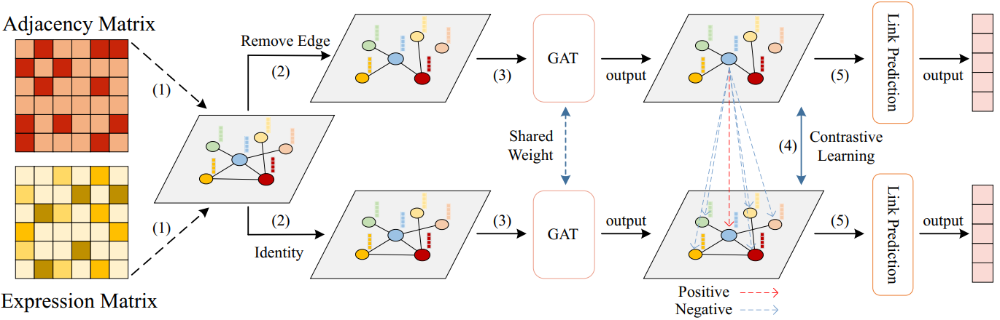

# GCLink: A Graph Contrastive Link Prediction Framework for Gene Regulatory Network Inference

## Dependencies Used in This Project
- Python 3.8.0
- PyTorch 1.12.1
- torch-scatter 2.1.0
- torch-sparse 0.6.15
- torch-geometric 2.3.1

## Usage
### 1. Set Up Conda Environment
Before running any scripts, set up the required environment using the provided `environment.yml` file.
**Create the Conda Environment**:
   - Navigate to the project directory and run the following command to create the environment:
     ```bash
     conda env create -f environment.yml
     ```
### 2. Gene Regulatory Network Inference
1. **Preparing for gene expression profiles and TF-Target interaction files**:
   - The datasets used in this project are provided in the `Benchmark Datasets` folder. 
   - `BL--ExpressionData.csv` contains the gene expression matrix.
   - `BL--network.csv` contains the TF-Target interactions.

2. **Generate Training, Validation and Testing sets**:
   - First, determine the **network type** (`Specific`, `Non-Specific`, or `STRING`) and **cell type** to be used.
   - Then, run the following command to generate the training, validation, and testing sets:
     ```bash
     python Train_Test_Split.py --net <network_type> --data <cell_type>
     ```
     Replace `<network_type>` with the chosen network type and `<cell_type>` with the chosen cell type.
   - The files in folder `Data/Specific/mESC 1000/sample1` provide an example of the generated data for the mESC Specific network.
3. **Run Inference**:
   - Set specific **cell_type** and **sample** to infer. For example:
     ```bash
     python GCLink_main.py -cell_type mESC -sample sample1
     ```
   - The output of the code includes:
     - **AUROC and AUPRC scores** for evaluation.
     - **Regulatory scores** for all test samples.
### 3. Transfer Learning
1. **Training a source model**
   - Train the source model using the previously generated training, validation, and testing data. Run the following command:
     ```bash
     python train_source.py
     ```
   - We default to using the dataset with the most available labels, the **mESC Specific Network**.
   - The source model will be stored in the `model` folder.
2. **Transfer to a target dataset**
   - Select a target dataset (e.g., `hESC`) and run the following command:
     ```bash
     python transfer.py --cell_type hESC --sample sample1
     ```
   - The target dataset is generated in the same way as mentioned earlier. The example target dataset used is the hESC Specific dataset.
   - The output of the code includes:
     - **AUROC and AUPRC scores** for evaluation.
     - **Regulatory scores** for all test samples.
## Contact
For any inquiries, feel free to raise issues or contact me via email at yoyiming7@gmail.com.
